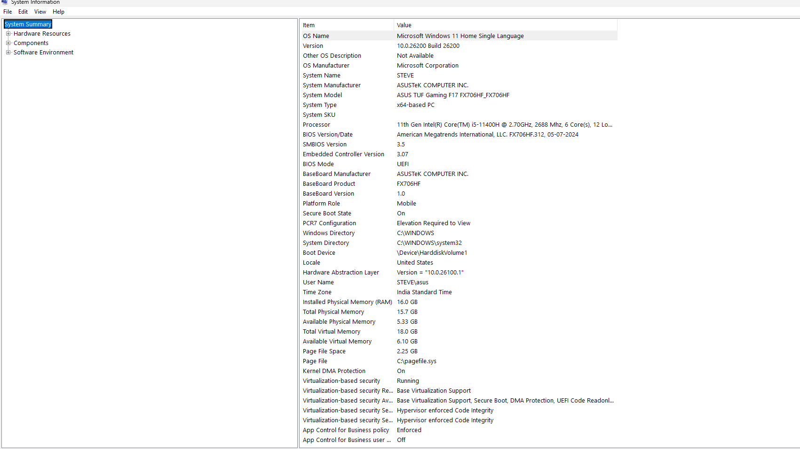
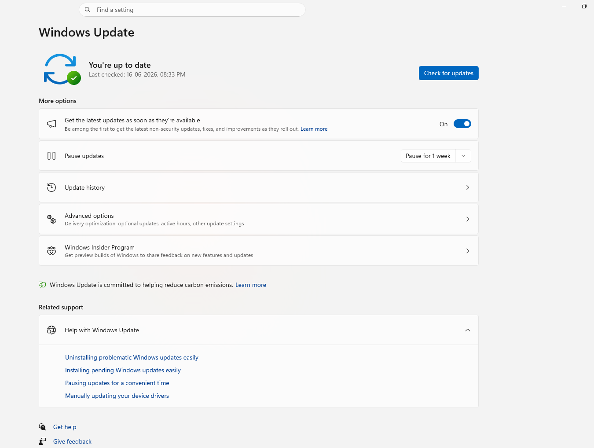
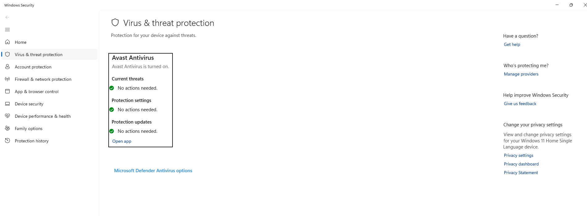
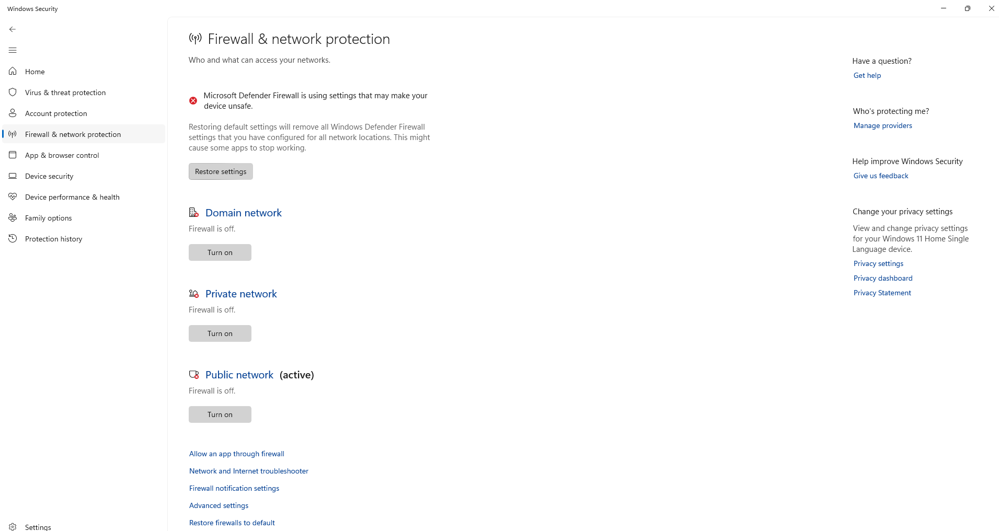
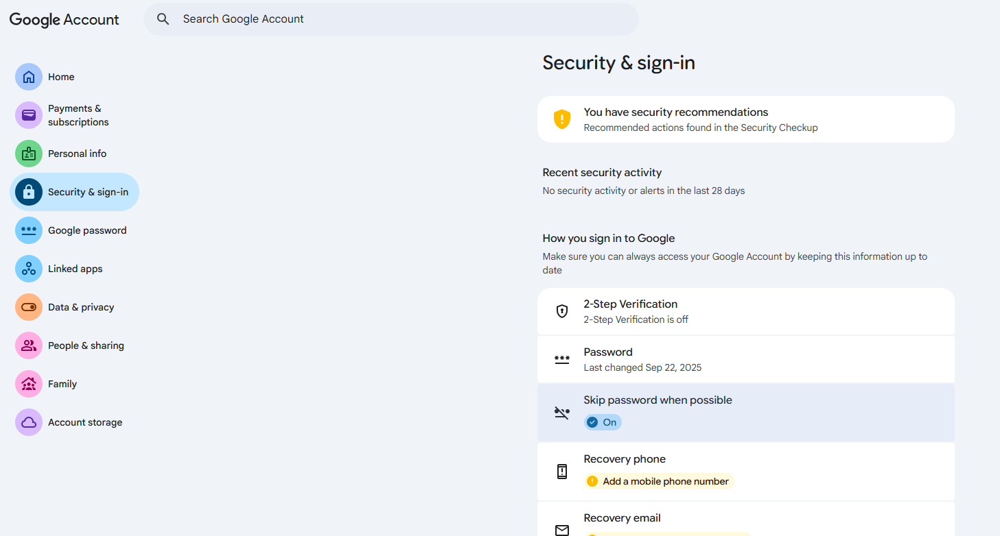
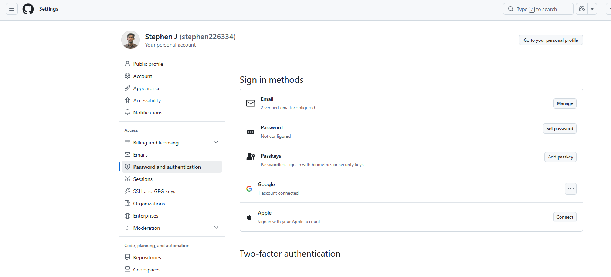
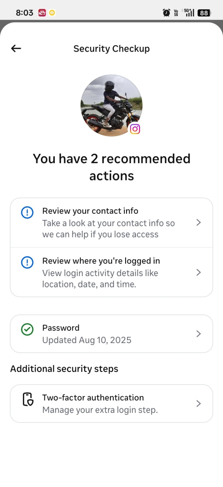
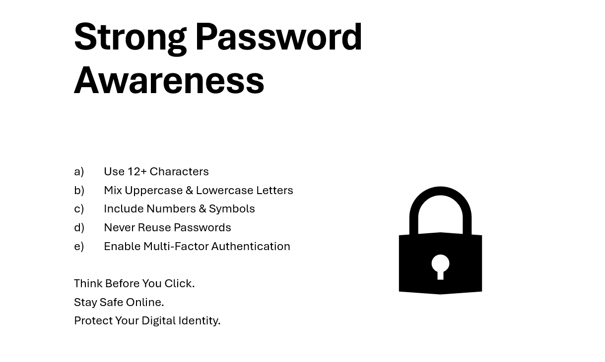

# Cyber Security Task 01

## Student Information

**Name:** Stephen J

**Task:** Cyber Security Task 01 - Personal Security Audit & Cyber Awareness Assessment

---

# Objective

The objective of this task is to assess personal cybersecurity practices, identify security risks, understand common cyber threats, and improve cyber awareness through self-evaluation and research.

---

# Part A - Device Security Assessment

The device security assessment was conducted to verify the security status of the system.

| Security Check | Status |
|---------------|--------|
| Operating System | Windows 11 |
| System Updated | Yes |
| Antivirus Installed | Yes |
| Firewall Enabled | Yes |

## Screenshots

### System Information



### Windows Update



### Antivirus Status



### Firewall Status



---

# Part B - Password Security Review

Password security questions, password policy, and related research are included in:

**research_answers.txt**

---

# Part C - Online Account Security Review

The following accounts were reviewed:

| Account | MFA Enabled | Strong Password | Recovery Email |
|----------|-------------|-----------------|---------------|
| Google | No | Yes | Yes |
| GitHub | No | No | Yes |
| Instagram | No | Yes | Yes |

## Screenshots

### Google Security



### GitHub Security



### Instagram Security



Additional analysis and findings are available in:

**research_answers.txt**

---

# Part D - Cyber Threat Research

The following cybersecurity threats were researched:

- Phishing
- Malware
- Ransomware
- Social Engineering
- Data Breach

Definitions, real-world examples, and prevention methods are included in:

**research_answers.txt**

---

# Part E - Cyber Security Awareness Poster

### Strong Password Awareness Poster



---

# Part F - Security Reflection

The complete reflection report is included in:

**research_answers.txt**

---

# Files Included

```text
CyberSecurity_Task_01_StephenJ
│
├── README.md
├── research_answers.txt
│
├── screenshots
│   ├── system_information.png
│   ├── windows_update.png
│   ├── antivirus_status.png
│   ├── firewall_status.png
│   ├── google_security.png
│   ├── github_security.png
│   └── instagram_security.png
│
└── poster
    └── awareness_poster.png
```

---

# Conclusion

This task helped improve understanding of cybersecurity fundamentals, password security, account protection, cyber threats, and safe online practices. It also highlighted the importance of strong passwords, Multi-Factor Authentication (MFA), software updates, antivirus protection, and cyber hygiene in protecting digital information.

---
